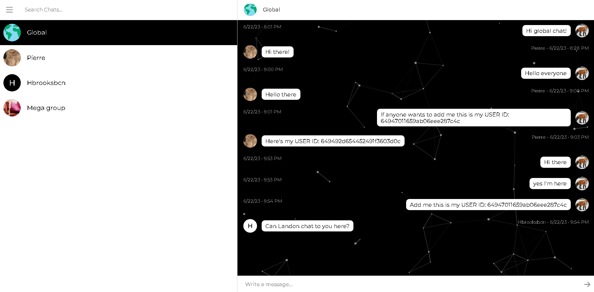

### **[Chatter Sphere](https://chatter-sphere.onrender.com/)**

## **Project Introduction:**

Chatter Sphere is an efficient and powerful full-stack application that transforms the way you communicate in the digital world. The application leverages cutting-edge technology to facilitate real-time interactions across the globe, making it simpler and more engaging than ever to connect with friends or meet new people.

Harnessing the power of Socket.IO, Node.js, Express, MongoDB, and React, Chatter Sphere brings you an easy-to-navigate and dynamic platform for real-time communication. Whether you're looking to catch up with an old friend, engage in group conversations, or meet new people, Chatter Sphere delivers a seamless experience with a user-friendly UI.

## **About The Project:**

Chatter Sphere is a full-stack real-time communication application, designed for an easy to understand UI and seamless experience.

The common functionalities are:

- Users can create an account, log in, and log out securely
- Allows users to communicate in real time with each other individually or in a group setting. Messages are sent and received instantaneously thanks to Socket.IO
- Users can search for other users, send friend requests, accept incoming friend requests, unsend sent friend requests, and remove friends from their friends list
- Users can update their profile information, including uploading a profile picture
- Users can create group chats, add their friends to the group, and all members of the group can chat with each other in real time. Users can also set a custom picture for the group
- Users get notified about sending friend requests, accepting friend requests, updating their user profile, updating the users individual group, and more

I'm using [Socket IO](https://socket.io/) to create a real-time environment

Credit: Socket IO

### **Built With:**

- React.js

- Node.js

- Express js

- JavaScript (ES6+)

- HTML/CSS

- Socket IO

- Mongoose

- MongoDB

### **Key Concepts:**

- Data Management and Storage

- Security and Privacy

- Cors

- Axios

- Bcrypt JS

- Responsive Web Design

- WebSockets

- Component-based Architecture

- Passport JS

- Real-Time Communication
